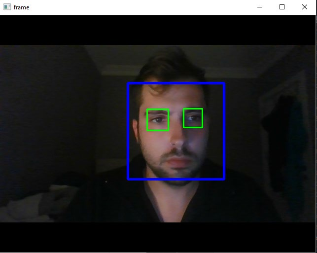
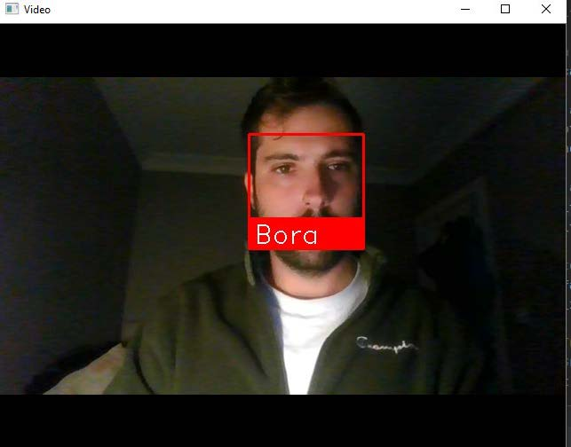

# Driver Drowsiness Detection and Alert System

This project aims to develop a system that detects drowsiness in a vehicle driver and autonomously alerts them to prevent accidents. Using computer vision techniques, the system monitors the driver’s eye movements to detect signs of drowsiness and alerts them accordingly.

## 📋 Table of Contents
- [About the Project](#about-the-project)
- [Technologies Used](#technologies-used)
- [Hardware Used](#hardware-used)
- [Requirements](#requirements)
- [Working Principle](#working-principle)
- [Project Design and Implementation](#project-design-and-implementation)
- [Outcomes](#outcomes)

## 📖 About the Project
The goal of this design project is to create a system that monitors a driver's eyes using computer vision (OpenCV) and warns them if signs of sleep or inattention are detected. The system processes the driver’s face and eye movements to detect eye closure and determine if the driver is drowsy. If drowsiness is detected, an alarm is triggered to alert the driver.

The main programming language is Python, with OpenCV used for image processing. The detected eye closure information is transferred to an Arduino microcontroller, which activates the warning system.

## 💻 Technologies Used
- **Python**: A dynamic, multi-paradigm programming language.
- **OpenCV**: Open-source computer vision library used for face and eye detection.
- **Face_recognition**: Detection for face recognation
- **Arduino UNO**: Microcontroller to trigger the warning system.

## 🛠️ Hardware Used
- **Computer**: Runs the image processing algorithms.
- **Camera**: Monitors the driver's face and eye movements.
- **Arduino UNO**: Microcontroller for the warning system.
- **Pan-Tilt Servo Motors**: Improves the ability to track the driver’s face.

## Requirements
- Python 3.6
- OpenCV and dlib libraries
- Arduino IDE

## 🔍 Working Principle
The script monitors the driver’s eyes by using facial landmarks to define eye regions. Eye Aspect Ratio (EAR) is calculated to determine if the eyes are open or closed. If the EAR drops below a certain threshold, the system considers that the driver’s eyes are closed and sounds an alert.

For real-time monitoring, playsound is used for triggering an audio alarm when drowsiness is detected, aiming to prevent any dangerous situation that may arise from the driver's inattention.

## 🖼️ Project Design and Implementation
The project involves using a webcam and an Arduino. The webcam captures live footage of the driver, which is processed to determine if the driver’s eyes are open or closed. If the system detects drowsiness, an alert is sounded via the Arduino system.

Pan-Tilt Servo Motors are used to keep the driver's face in view, ensuring that the camera can adjust to different drivers, making detection more effective.

## Outcomes

Below are some of the outcomes and results of the Driver Drowsiness Detection and Alert System:

### Eye Detection Example

The algorithms tested on the database (Haar Cascade and LBP Cascade) achieved the highest success rates compared to other results. Using the Haar Cascade classifier, the optimal detectMultiScale values for detecting eyes were determined to be "roi_gray, 1.3, 5". The method was used for sample face and eye detection.

### Face Detection Example

Detection of the faces of individuals whose data has been uploaded to the system.

### Alert Trigger Example

When an abnormal eye condition is detected, a warning is given as shown. At the same time, an alarm is activated to alert the driver.